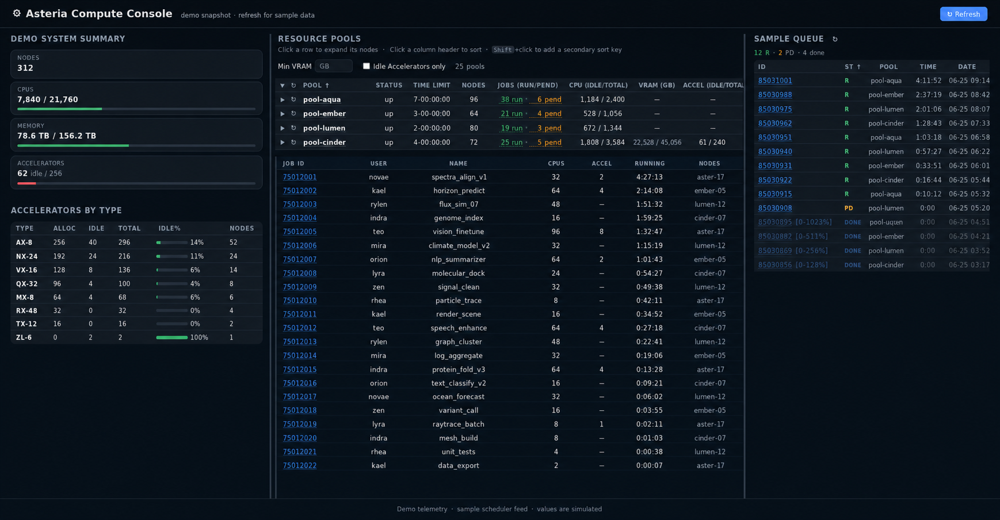

# slurmboard

A lightweight, dependency-free web dashboard for Slurm clusters.

Deploy directly on the Slurm login node — no SSH tunneling, no extra packages, just Python 3 stdlib.



## Features

- **Three-column layout** — cluster summary, partition table, and personal job history side by side; columns are draggable to resize
- **Cluster summary** — idle/total for nodes, CPUs, memory, GPUs with green progress bars (green = more idle = better)
- **GPU breakdown by type** — H100 / A100 / V100 / … with idle% bars
- **Partition table**
  - Multi-column sort (click header = primary, Shift+click = secondary)
  - Filter by minimum VRAM and/or "idle GPUs only"
  - Per-partition async refresh (↻) without losing expand/sort state
  - Running / pending job counts per partition; click to expand inline job list
  - Click any row to expand node details (CPU, memory, GPU idle/total, VRAM, load)
- **Job detail page** at `/job/<id>` — full `scontrol` info, linked from job lists
- **My Jobs panel** — persistent job history (`jobs_history.json`), marks finished jobs as DONE; sortable by state / ID / time / date; shows submit time
- **All progress bars show idle ratio** — green bar = available resources

## Requirements

- Python ≥ 3.7 (stdlib only — no pip installs)
- Running on a node with `sinfo`, `scontrol`, `squeue` in `$PATH` (Slurm login or submit node)

## Usage

```bash
# default: bind 0.0.0.0:8000
./slurmboard.py

# custom port / bind address
./slurmboard.py --port 9000 --host 127.0.0.1
```

Open `http://<login-node>:8000` in your browser. Use the ↻ buttons to refresh data without a full page reload.

## How it works

Each request shells out to:

```
scontrol -o show node        # per-node CPU / memory / GPU (gres) state
sinfo -h -o "%P|%a|%l"      # partition availability and time limits
squeue -h -o "%P|%i|..."    # job counts, states, submit times per partition
```

Results are parsed, serialised as JSON, and embedded into the HTML. The `/data` endpoint returns fresh JSON for async partial refresh. Frontend is vanilla JS — no framework, no build step.

Job history is persisted to `jobs_history.json` (same directory as the script, gitignored) so completed jobs remain visible in My Jobs for 7 days.

## Typical workflow

1. You need N GPUs with at least X GB VRAM.
2. Open slurmboard, filter by **Min VRAM**, sort by **GPU (idle/total) ↓**.
3. Check **Jobs (run/pend)** to gauge queue pressure.
4. Click a partition row to expand its nodes and pick the least loaded one.
5. Monitor your submitted jobs in the **My Jobs** panel on the right.

## Inspiration

Motivated by [slurmmanager](https://github.com/paulgavrikov/slurmmanager); built to run without SSH access to compute nodes.
