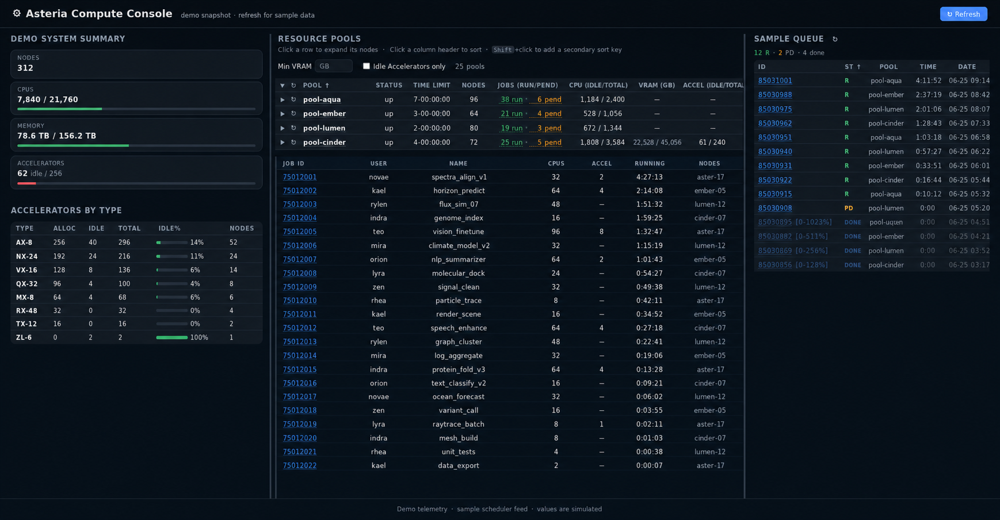

# slurmboard

A lightweight, dependency-free web dashboard for Slurm clusters.

Run it directly on a Slurm login node, or launch it from your Mac through an SSH tunnel — no extra packages, just Python 3 stdlib.



## Features

- **Three-column layout** — cluster summary, partition table, and personal job history side by side; columns are draggable to resize
- **Cluster summary** — idle/total for nodes, CPUs, memory, GPUs with green progress bars (green = more idle = better)
- **GPU breakdown by type** — H100 / A100 / V100 / … with idle% bars
- **Partition table**
  - Multi-column sort (click header = primary, Shift+click = secondary)
  - Filter by minimum VRAM and/or "idle GPUs only"
  - Lazy per-partition node loading and async refresh (↻) without losing expand/sort state
  - Adaptive running/pending counts: automatic on smaller clusters and request-driven on larger systems
  - Click any row to load and expand its node details (CPU, memory, GPU idle/total, VRAM)
- **Job details** — in-dashboard modal plus `/job/<id>`, with `scontrol` and completed-job `sacct` fallback
- **My Jobs panel** — seven-day Slurm accounting history; sortable by state / ID / time / date; shows submit time
- **All progress bars show idle ratio** — green bar = available resources
- **Storage quota panel** — on-demand disk-space and file-count usage across POSIX/NFS, Lustre, GPFS, BeeGFS, and site-specific HPC tools

## Installation

```bash
git clone https://github.com/zhangdoudou/slurmboard.git
cd slurmboard
chmod +x slurmboard.py
```

Optionally add it to your `PATH` for convenience:

```bash
ln -s "$PWD/slurmboard.py" ~/.local/bin/slurmboard
```

No `pip install` needed — pure Python stdlib.

## Requirements

- Python ≥ 3.7 (stdlib only — no pip installs)
- Running on a node with `sinfo`, `scontrol`, `squeue` in `$PATH` (Slurm login or submit node)

## Usage

### Launch from your Mac

If your clusters are already configured as named hosts in `~/.ssh/config`, start the local launcher:

```bash
./slurmboard.py --launcher
```

Your browser normally opens `http://127.0.0.1:65432` (or another free local port if that one is already occupied). The page lists concrete `Host` aliases from your SSH config; click **Connect**, then **Open dashboard**. For example, this entry appears as a `roihu-gpu` button:

```ssh-config
Host roihu-gpu
    HostName login.example.org
    User my-user
    IdentityFile ~/.ssh/id_ed25519
```

If a host uses password authentication, enter it in that host card before
clicking **Connect**. The password is sent only to the launcher on
`127.0.0.1`. After a successful connection it is cached in memory for that host
and reused when reconnecting, but it is never added to the command line, logs,
SSH config, or launcher preferences. Click **Forget password** to clear it, or
quit the launcher to clear all cached passwords. Leave the field blank before
the first connection to use your normal SSH key or agent.

The launcher does all of the following for you:

- uses the host's existing SSH settings, including `ProxyJump`, identity files, and included config files
- sends the current `slurmboard.py` to the remote host, so no separate remote installation is needed
- starts the remote dashboard on loopback and creates the local tunnel
- lets you pin frequently used hosts to the top; pins persist between launcher runs
- stops the remote dashboard and tunnel when you click **Stop** or quit the launcher with `Ctrl+C`

The launcher uses keys, agents, `ProxyJump`, and other options from your SSH
configuration; password-only hosts can use the session-cached field described
above. It automatically chooses a high, temporary port for each connection, so
it does not conflict with an already-running dashboard. If you specifically
need a fixed remote port, set one explicitly:

```bash
./slurmboard.py --launcher --remote-port 65435
```

Wildcard-only entries such as `Host *` are not shown because they are SSH defaults rather than connectable host names.

The dashboard refreshes its compact cluster summary every minute by default. Use the **Auto refresh** menu to choose manual refresh, 15 or 30 seconds, or 1, 2, or 5 minutes. The choice is remembered across launcher ports. Automatic refresh skips hidden browser tabs. Roihu-sized clusters load partition counts and personal jobs automatically; larger clusters keep those panels click-to-load, and later history refreshes remain manual.

Storage quota discovery supports standard `quota`, Lustre `lfs quota`, IBM Storage Scale/GPFS `mmlsquota`, BeeGFS 7 and 8, LUMI tools, and common site wrappers. If a cluster provides another read-only command, pass it explicitly; the launcher forwards it safely to the remote dashboard without using a shell:

```bash
./slurmboard.py --launcher --quota-command "site-quota --human-readable"
```

Recognized output is displayed as usage bars. Unrecognized output is still shown verbatim in the quota panel, making proprietary site commands usable without adding a parser first.

### Run directly on a login node

```bash
# default: bind an available port above 9000
./slurmboard.py

# custom port / bind address
./slurmboard.py --port 9100 --host 127.0.0.1
```

When no port is specified, slurmboard first tries port 9001. If it is occupied, the server probes up to 99 additional, non-sequential ports above 9000 using jittered exponential backoff. It prints a forwarding command using the selected port, for example:

```text
On your local machine, run this SSH forwarding command:

  ssh -N -L 9001:127.0.0.1:9001 <your-ssh-host>
```

Replace `<your-ssh-host>` with the host or SSH config alias you normally use, then run the command in a terminal on your local computer. For example:

```bash
ssh -N -L 9001:127.0.0.1:9001 my-cluster
```

Keep that terminal open, then open `http://127.0.0.1:9001` in your local browser. Use the ↻ buttons to refresh data without a full page reload.

## How it works

The first page load makes one compact, partition-oriented query:

```
sinfo -h -o "%P|%a|%l|..."  # aggregate partition/resource summary
```

On clusters with up to 1,000 nodes, slurmboard also makes one compact node query
and caches it for a minute. This fills exact memory allocation, GPU allocation,
idle-GPU, and per-model VRAM fields on clusters such as Roihu. Larger systems
keep the partition-only path so dashboards such as LUMI remain responsive.
The smaller-cluster path also restores automatic partition job counts and the
personal active queue, then loads recent history asynchronously after the page
appears. Those panels stay click-to-load on larger systems.

Additional commands are scoped and loaded asynchronously:

```
sinfo -N -e                  # cached exact resources on clusters up to 1,000 nodes
sinfo -N -e -p <partition>   # exact nodes only after expanding a partition
squeue                       # cached partition counts on clusters up to 1,000 nodes
squeue -p <partition>        # jobs only after clicking “load jobs”
squeue -u <user>             # personal active queue
sacct -u <user>              # personal seven-day history
quota / filesystem tools     # storage and file quotas, only when requested
```

Results are cached to absorb repeated clicks and concurrent Slurm requests are serialized to avoid bursts against the controller. Storage quotas are cached for five minutes and loaded only when you click their refresh button. The frontend is vanilla JS — no framework or build step. Only the compact cluster summary polls at the selected automatic-refresh interval (one minute by default). On smaller clusters its cached partition job counts and an already-open active queue refresh with it; exact node details, quotas, and later history refreshes remain request-driven.

Job history is read from Slurm accounting (`sacct`) for the last seven days.

## Typical workflow

1. You need N GPUs with at least X GB VRAM.
2. Open slurmboard, filter by **Min VRAM**, sort by **GPU (idle/total) ↓**.
3. Check **Jobs (run/pend)** to gauge queue pressure.
4. Click a partition row to expand its nodes and pick the least loaded one.
5. Monitor your submitted jobs in the **My Jobs** panel on the right.

## Inspiration

Motivated by [slurmmanager](https://github.com/paulgavrikov/slurmmanager); built to run without SSH access to compute nodes.

## License

MIT © 2026 zhangd — see [LICENSE](LICENSE).
